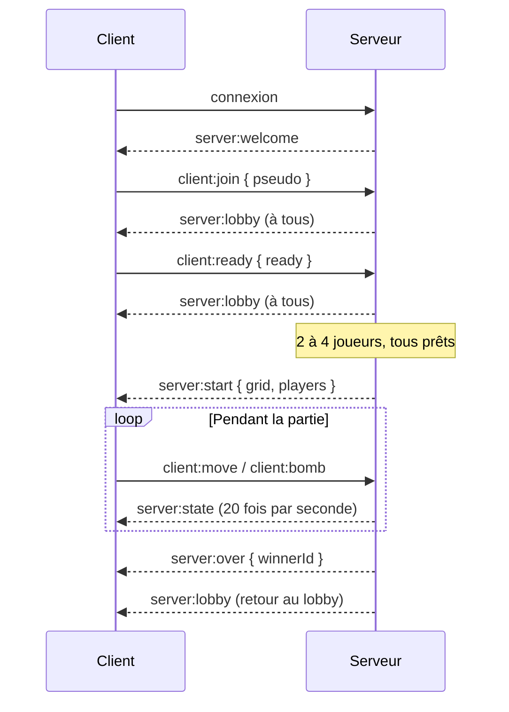

# Protocole WebSocket

Messages échangés entre le client et le serveur de Bomberman Arena. Les noms, les règles et le format détaillé des données sont définis dans [`shared/`](../shared/index.js), importé par le client comme par le serveur : c'est ce code qui fait foi.

Version du protocole : **1**.

## Organisation du code

Le client et le serveur importent toujours depuis `shared/index.js`, jamais directement depuis `shared/src/`.

| Fichier | Contenu |
|---|---|
| `shared/index.js` | Point d'entrée, réexporte les autres fichiers |
| `shared/src/messages.js` | Noms des messages (`CLIENT_EVENTS`, `SERVER_EVENTS`), version du protocole et contenu de chaque message |
| `shared/src/settings.js` | Règles de partie (`GAME_SETTINGS`) : nombre de joueurs, longueur du pseudo, fréquence d'envoi |
| `shared/src/map.js` | Dimensions du plateau et contenu des cases (`CELL`) |
| `shared/src/entities.js` | Joueurs, bombes, explosions, bonus, directions |
| `shared/src/errors.js` | Codes d'erreur (`ERROR_CODES`) |

Exemple côté serveur :

```js
import { SERVER_EVENTS, PROTOCOL_VERSION } from '../../../shared/index.js';

socket.emit(SERVER_EVENTS.WELCOME, { id: socket.id, protocolVersion: PROTOCOL_VERSION });
```

## Principes

- **Transport** : socket.io, serveur sur `http://localhost:3000` en développement.
- **Format** : un événement par message, accompagné d'un objet JSON.
- **Nommage** : `client:*` pour les messages du client, `server:*` pour ceux du serveur.
- **Autorité du serveur** : le client envoie des intentions, le serveur valide chaque action, calcule l'état du jeu et le diffuse. Le client ne fait qu'afficher.
- **Erreurs** : un message invalide ou envoyé au mauvais moment est ignoré, et le client reçoit un `server:error`.

## Déroulement



## Client vers serveur

| Message | Données | Quand |
|---|---|---|
| `client:join` | `{ pseudo }` (1 à 16 caractères) | Le joueur rejoint le lobby |
| `client:ready` | `{ ready: boolean }` | Le joueur se déclare prêt ou annule |
| `client:move` | `{ direction: 'up' \| 'down' \| 'left' \| 'right' }` | Déplacement d'une case |
| `client:bomb` | `{}` | Pose d'une bombe sur la case du joueur |

## Serveur vers client

| Message | Données | Quand |
|---|---|---|
| `server:welcome` | `{ id, protocolVersion }` | À la connexion |
| `server:lobby` | `{ players, minPlayers, maxPlayers, canStart }` | À chaque changement dans le lobby |
| `server:start` | `{ grid, players }` | Début de partie |
| `server:state` | `{ tick, grid, players, bombs, explosions, bonuses }` | 20 fois par seconde pendant la partie |
| `server:over` | `{ winnerId }` (`null` si égalité) | Fin de partie |
| `server:error` | `{ code, message }` | Action refusée, envoyé au seul client concerné |

Exemple de `server:lobby` :

```json
{
  "players": [
    { "id": "aB3xK9pQ", "pseudo": "Theo", "slot": 1, "ready": true },
    { "id": "Zt7mW2eR", "pseudo": "Come", "slot": 2, "ready": false }
  ],
  "minPlayers": 2,
  "maxPlayers": 4,
  "canStart": false
}
```

La grille est un tableau de 11 lignes de 13 cases, lue avec `grid[y][x]` : `0` vide, `1` mur indestructible, `2` brique destructible.

## Règles

- Un seul lobby, de 2 à 4 joueurs, avec des pseudos uniques.
- Un joueur déconnecté pendant la partie est considéré comme mort.
- Une connexion pendant une partie est acceptée, mais `client:join` est refusé jusqu'au retour au lobby.

## Codes d'erreur

| Code | Signification |
|---|---|
| `INVALID_PAYLOAD` | Données absentes ou au mauvais format |
| `INVALID_PSEUDO` | Pseudo vide ou trop long |
| `PSEUDO_TAKEN` | Pseudo déjà utilisé |
| `LOBBY_FULL` | 4 joueurs déjà présents |
| `GAME_IN_PROGRESS` | Une partie est en cours |
| `NOT_IN_LOBBY` | Action de lobby sans avoir rejoint |
| `NOT_IN_GAME` | Action de jeu hors d'une partie |

## Faire évoluer le protocole

Modifier `shared/` et ce document dans la même Pull Request, relue par au moins une personne du front et une du back. Un changement incompatible (message renommé ou supprimé, champ modifié) incrémente `PROTOCOL_VERSION`.
